# Dual Band Microstrip Patch Antenna Design

This project demonstrates the design and simulation of a **dual-band microstrip patch antenna** operating at **2 GHz** and **5 GHz** using **CST Studio Suite 2022**. The antenna is optimized for modern wireless communication systems requiring compact size, high efficiency, and multi-band capability.

---

## 🛠️ Design Details

- **Substrate**: FR4 Epoxy (εr = 4.3, thickness = 1.6 mm)
- **Patch Material**: Copper
- **Feed Technique**: Inset Microstrip
- **Software**: CST Studio Suite 2022

## 🧮 Calculations

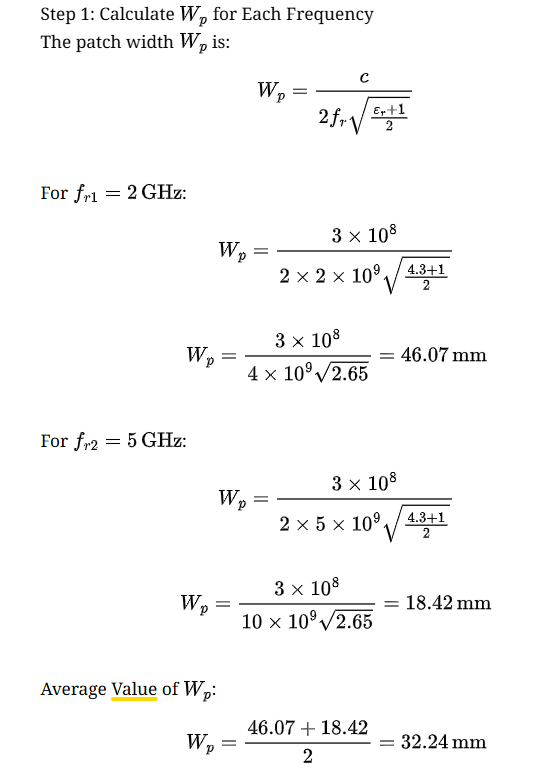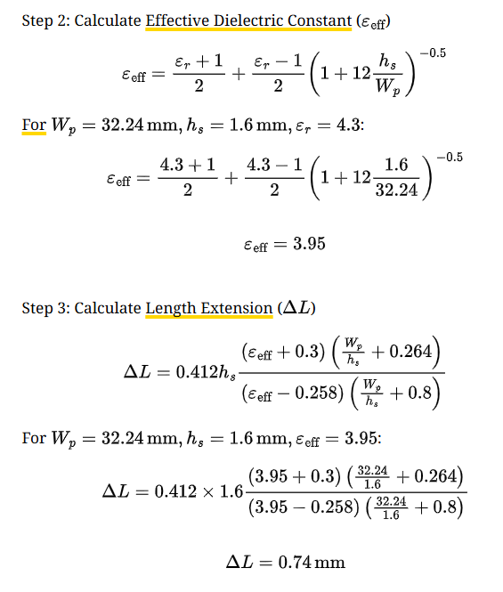
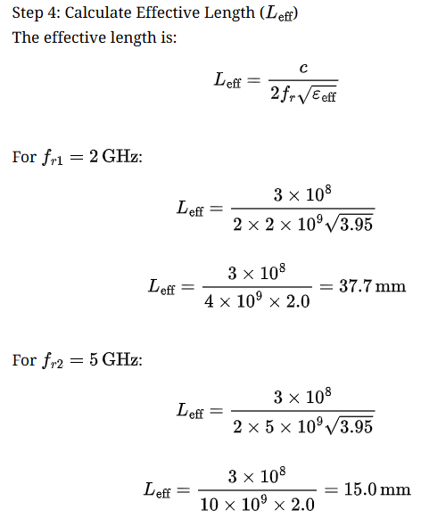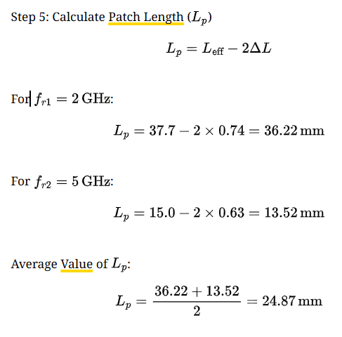
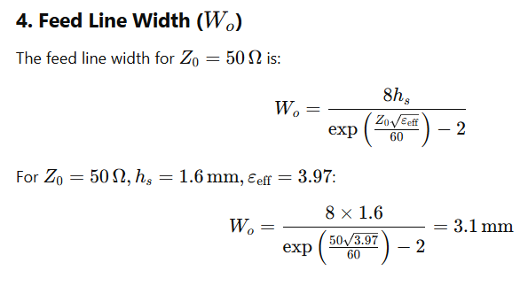

---
 

### 📐 Antenna Geometry

### 📊 Complete Parameter List

| Parameter                                  | Description                                               | Value (mm) |
|--------------------------------------------|-----------------------------------------------------------|------------|
| **Wg**                                      | Width of the ground plane                                 | 49         |
| **Lg**                                      | Length of the ground plane                                | 46         |
| **Hg**                                      | Height of the ground plane                                | 1          |
| **Hs**                                      | Height of substrate                                       | 1.6        |
| **Wp**                                      | Patch width                                               | 27.7       |
| **Lp**                                      | Patch length                                              | 24.5       |
| **Hp**                                      | Patch height (copper thickness)                           | 0.015      |
| **Wo**                                      | Width of microstrip feed line                             | 3.137      |
| **IFG**                                     | Inset feed gap                                            | 2.5        |
| **IFD**                                     | Inset feed distance                                       | 6          |
| **WS1**                                     | Width of Slot 1                                           | 23         |
| **LS1**                                     | Length of Slot 1                                          | 5          |
| **S1Lp**                                    | Distance between Slot-1 and edge of the patch (lengthwise)| 15         |
| **S1Wp**                                    | Distance between Slot-1 and edge of the patch (widthwise) | 13         |
| **LS2**                                     | Length of Slot 2                                          | 25         |
| **WS2**                                     | Width of Slot 2                                           | 6          |
| **S2Lg**                                    | Distance between Slot-2 and edge of the ground plane      | 28         |

---

## 🖼️ Design and Simulation Results

### Antenna Views
| Front View | Back View |
|------------|-----------|
| 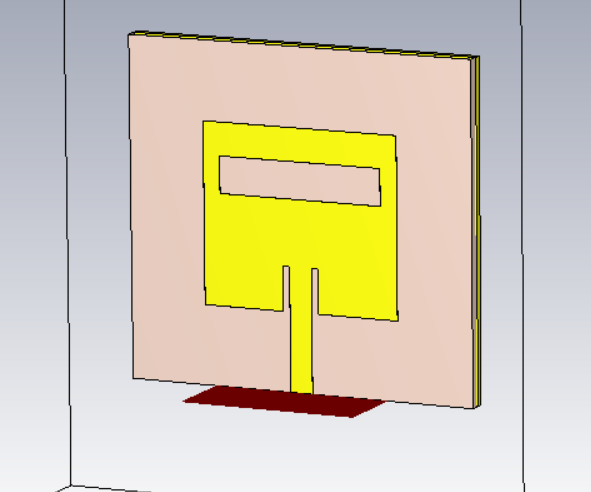 | 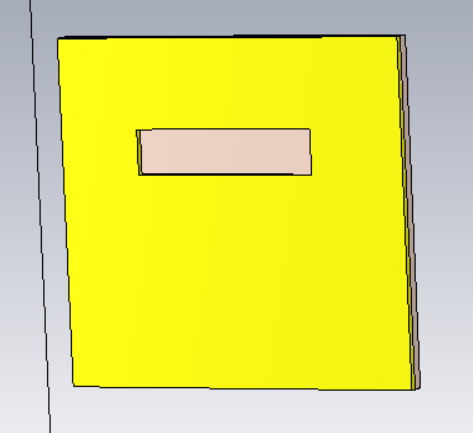 |

### Farfield Plots

- **2 GHz (1D)**  
  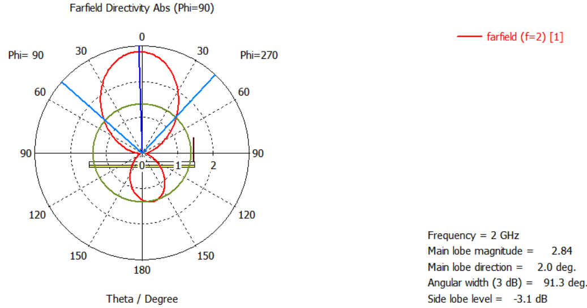

- **5 GHz (1D)**  
  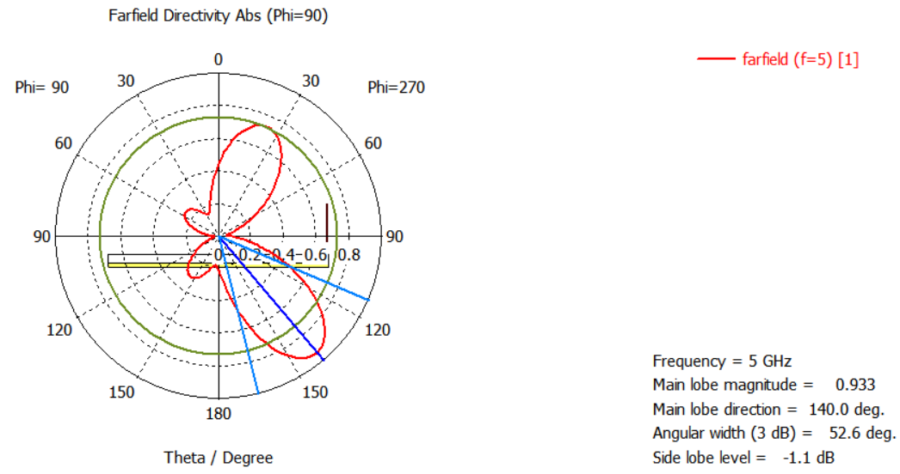

- **3D Radiation Patterns**  
  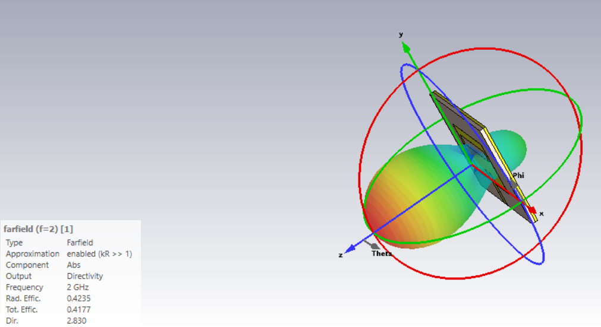  
  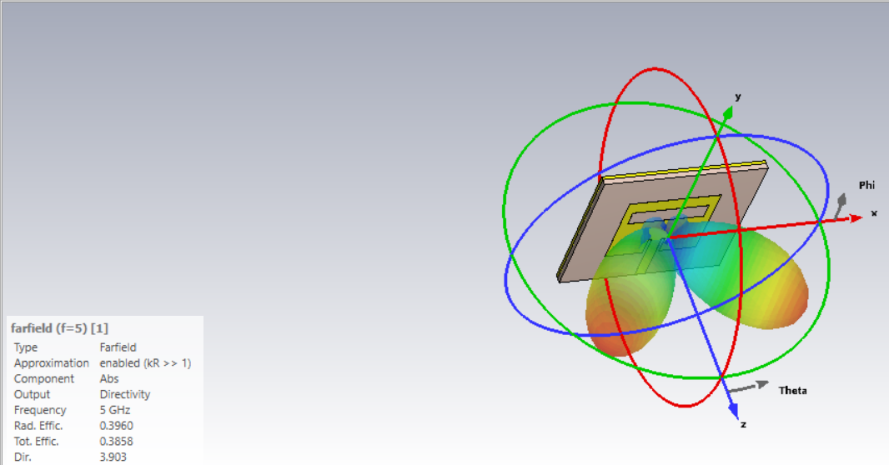

### Performance Graphs

- **S-Parameter (Return Loss)**  
  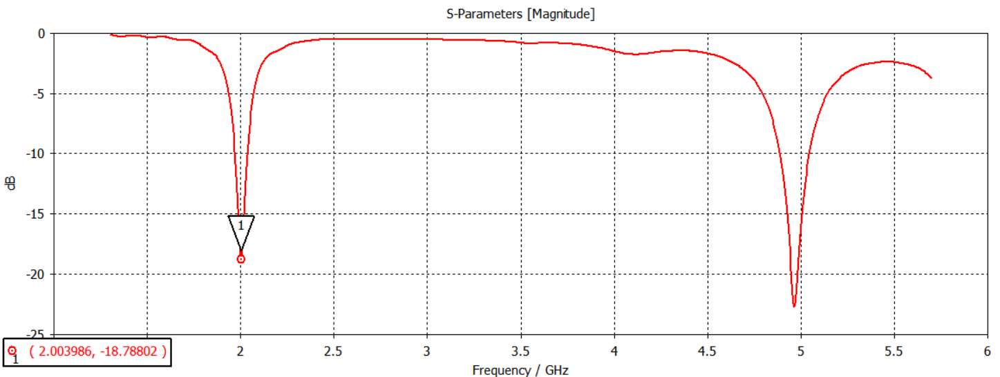

- **VSWR**  
  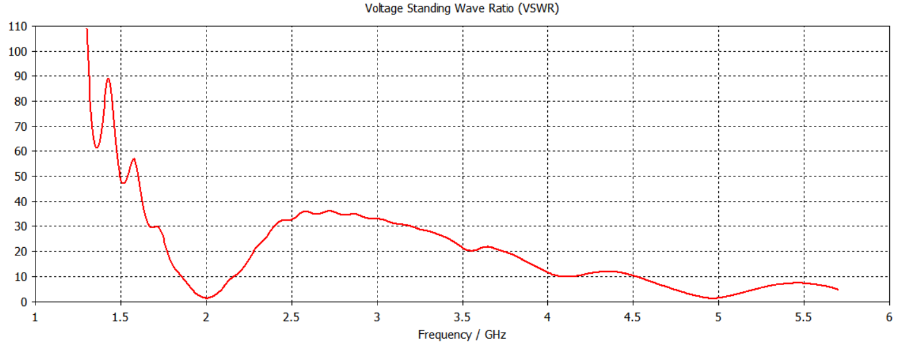

---

## 📈 Performance Metrics

| Frequency | Gain | Efficiency | Bandwidth | VSWR |
|-----------|------|------------|-----------|------|
| 2 GHz     | 1 dB | > 40%      | 200 MHz   | < 1  |
| 5 GHz     | 2 dB | > 40%      | 500 MHz   | < 1  |

---

